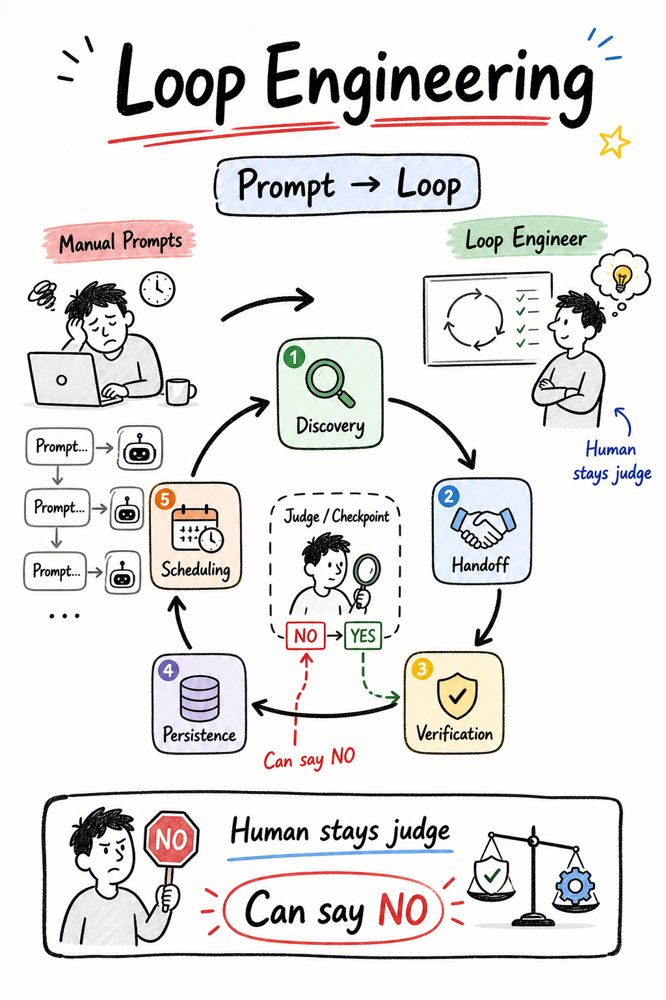
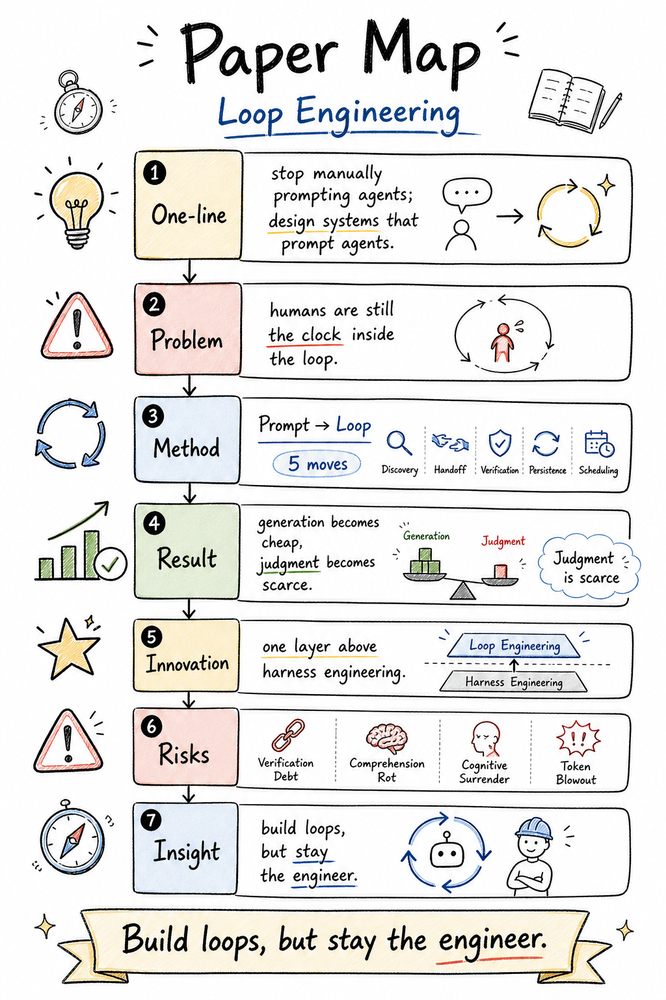

# Loop Engineering 论文分享案例

这组案例展示论文分享 Skill 的两种直接产物：用问题钩子吸引阅读的封面，以及压缩论文主线的 Paper Map。

## 发布文案

**标题：**Loop Engineering：别再手动 Prompt Agent 了

备选标题：

- 一张 Paper Map 看懂 Loop Engineering
- Agent 不是多写 Prompt，而是设计可验证的循环

**简介：**Loop Engineering 讨论的不是让 Agent 无限自我迭代，而是把发现、交接、验证、持久化和调度组织成可控的工程循环。最重要的提醒也很朴素：自动化越来越便宜，人的判断反而更稀缺。这两张图把论文的主线、方法和风险压缩成一套可快速复习的分享卡。

**标签：**#LoopEngineering #AIAgent #智能体 #论文阅读 #软件工程 #AI应用 #开发者工具 #技术分享
